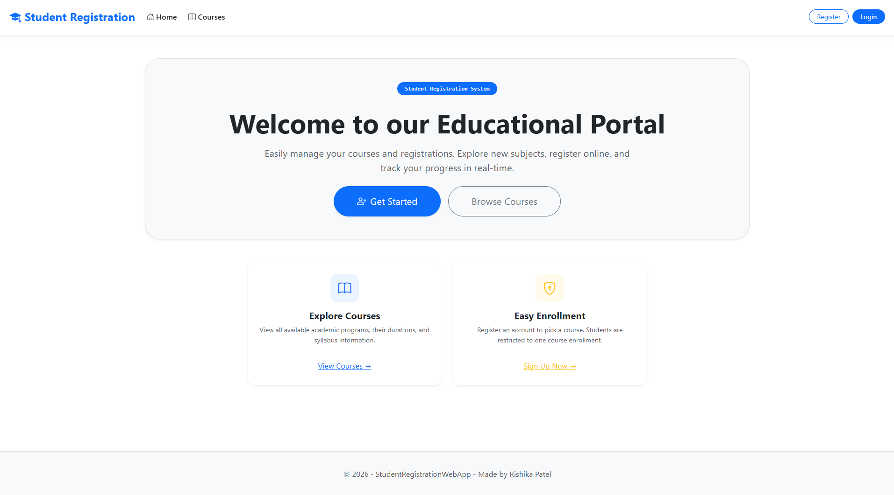
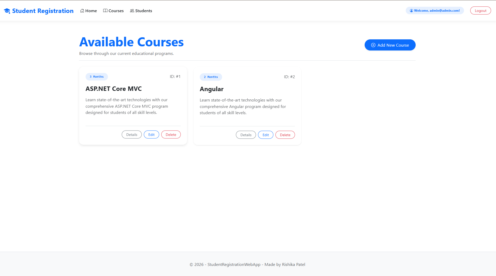
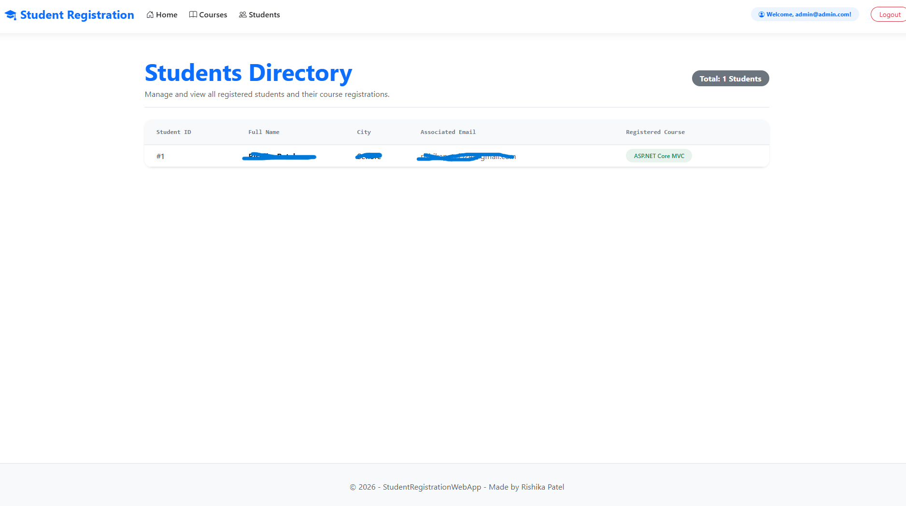
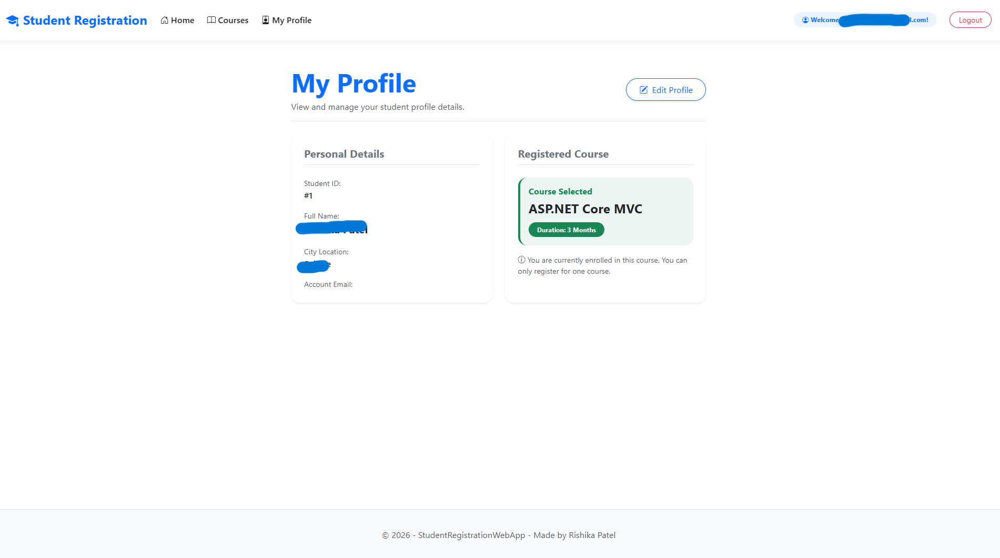

# Student Registration Web Application

A full-stack ASP.NET Core MVC Web Application built with Entity Framework Core and ASP.NET Core Identity for managing student course enrollments, user authentication, and role-based access control (RBAC).

---

## ℹ️ About the Project

**Student Registration WebApp** is an end-to-end academic portal designed to manage course offerings and student registrations securely. 

The application implements modern web architecture principles using **ASP.NET Core 10 MVC**, **Entity Framework Core (Code First)**, and **ASP.NET Core Identity**. It demonstrates role-based security where **Students** can browse academic offerings and register for a single course, while **Administrators** retain full management capabilities over course catalogs and student records.

### Key Objectives:
* **Secure Authentication**: User registration and login using ASP.NET Core Identity.
* **Role-Based Authorization (RBAC)**: Fine-grained access controls separating Student and Administrator privileges.
* **Database Management**: Entity Framework Core DbContext with relationship mapping and automatic seeding.
* **Responsive UI**: Role-aware navbar navigation and modern Bootstrap 5 interface design.

---

## 🌟 Features & Highlights

* **User Authentication & Identity**: Built-in support for Registration, Login, Logout, and Role Management using ASP.NET Core Identity.
* **Automatic Role Assignment**: Newly registered users are automatically assigned the **Student** role and a linked Student profile.
* **Role-Based Authorization**:
  * **Administrator**: Has full CRUD permissions over Courses and can view all registered Students.
  * **Student**: Can view available courses, view & edit their own profile, and register for a course.
* **Single Course Registration Constraint**: Enforces a business rule allowing each student to register for only one course.
* **Dynamic Role-Aware Navigation Bar**: Dynamically renders menu options based on the authenticated user's assigned role.
* **Custom Access Denied Page**: Securely handles unauthorized access attempts.
* **Modern UI & UX**: Clean, responsive interface styled with Bootstrap 5 and Bootstrap Icons.

---

## 🛠️ Technology Stack

* **Framework**: ASP.NET Core 10.0 (Model-View-Controller)
* **ORM**: Entity Framework Core
* **Database**: SQLite / SQL Server compatible
* **Authentication & Security**: ASP.NET Core Identity (Individual Accounts)
* **Frontend**: HTML5, Razor Views, Vanilla CSS, Bootstrap 5, Bootstrap Icons

---

## 👥 Role & Authorization Matrix

| Feature / Action | Anonymous User | Student | Administrator |
| :--- | :---: | :---: | :---: |
| **View Home & Public Pages** | ✅ | ✅ | ✅ |
| **Browse Courses List** | ✅ | ✅ | ✅ |
| **Register & Login Account** | ✅ | ❌ *(Already Logged In)* | ❌ *(Already Logged In)* |
| **Register for a Course** | ❌ | ✅ *(Single course limit)* | ❌ *(Admin role)* |
| **View & Edit Personal Profile** | ❌ | ✅ *(Own profile only)* | ❌ *(Admin role)* |
| **Create, Edit, Delete Courses** | ❌ | ❌ *(Restricted)* | ✅ |
| **View Master List of Students** | ❌ | ❌ *(Privacy Rule)* | ✅ |

> **Explanation of Red Cross (❌) Restrictions:**
> * **Register / Login (❌ for Student & Admin)**: Users who are already signed in do not need to register or log in again (the navbar shows *Logout*).
> * **Register for Course & Profile (❌ for Admin & Anonymous)**: Anonymous visitors must log in first. Administrators manage the portal and do not enroll in student courses.
> * **Course Management & Student List (❌ for Student & Anonymous)**: Per security & privacy requirements, students are strictly forbidden from modifying courses or viewing other students' private information.

---

## 🗄️ Database Architecture

### Entities & Relationships

1. **Course**:
   * `CourseId` (Primary Key, int)
   * `CourseName` (string)
   * `CourseDuration` (int, in months)
   * Navigation property: `ICollection<Student> Students`

2. **Student**:
   * `StudentId` (Primary Key, int)
   * `FullName` (string)
   * `City` (string)
   * `CourseId` (Foreign Key referencing `Course`, nullable)
   * `UserId` (Foreign Key referencing `AspNetUsers`)
   * Navigation properties: `Course`, `User`

---

## 🚀 Getting Started

### Prerequisites

* [.NET SDK 10.0](https://dotnet.microsoft.com/download) or higher
* [Visual Studio 2022 / VS Code](https://visualstudio.microsoft.com/)

### Installation & Execution

1. **Clone the Repository**:
   ```bash
   git clone https://github.com/Rishikaaz/Student-Registration-WebApp.git
   cd Student-Registration-WebApp
   ```

2. **Restore Dependencies**:
   ```bash
   dotnet restore
   ```

3. **Apply Database Migrations**:
   ```bash
   dotnet ef database update
   ```

4. **Run the Application**:
   ```bash
   dotnet run
   ```

5. Open your browser and navigate to:
   👉 `http://localhost:5244`

---

## 🔑 Default Administrator Credentials

Upon initial database seeding, a default administrator account is automatically generated:

* **Email**: `admin@admin.com`
* **Password**: `Admin@123`

---

## 📸 Application Screenshots

### 🏠 Home Page


### 📚 Available Courses List (Admin / Student View)


### 👥 Students Directory (Admin View)


### 👤 Student Profile & Enrolled Course


---

## 📁 Directory Structure

```
StudentRegistrationWebApp/
│── Areas/
│   └── Identity/              # Customized Identity Razor pages (Register, AccessDenied, etc.)
│── Controllers/
│   ├── CoursesController.cs   # Course management endpoints
│   ├── HomeController.cs      # Homepage logic
│   └── StudentsController.cs  # Student profile & course registration endpoints
│── Data/
│   ├── DbInitializer.cs       # Database role and admin seeding logic
│   └── StudentCourseDbContext.cs # EF Core DbContext
│── Models/
│   ├── Course.cs              # Course entity model
│   └── Student.cs             # Student entity model
│── screenshots/               # Application UI screenshots
│   ├── courses-list.png
│   ├── home-page.png
│   ├── student-profile.png
│   └── students-directory.png
│── Views/
│   ├── Courses/               # Course views (Index, Create, Edit, Delete, Details)
│   ├── Home/                  # Home page views
│   ├── Shared/                # Layout and login partial views
│   └── Students/              # Student views (Profile, EditProfile, Index, RegisterCourse)
│── wwwroot/                   # Static assets (CSS, JS, Bootstrap)
└── Program.cs                 # App configuration & middleware pipeline
```

---

## 👩‍💻 Author

**Rishika Patel**